# COMP1100/1130 Assignment 1: Langton's Ant

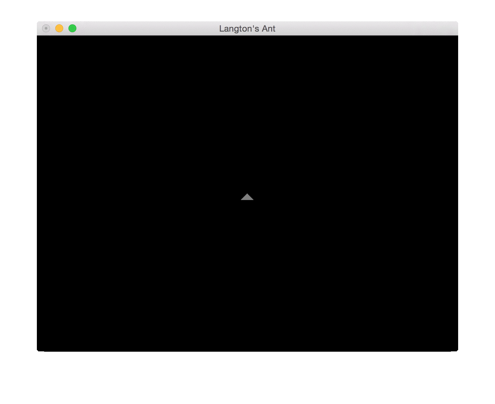

## What is this?

  - A collection of dots?
  - My notes after listening to Tony?
  - An artistic rendering of an alien space ship?
  - Cat videos?

Ok, seriously, what is this? Well, you are going to generate this yourself..
with some help from us.

This is **Langton's Ant**, an example of what we call a **cellular automaton**
— a world of *cells* that can change their state based on a collection of
rules, without any input (*automatically*, if you will, hence *automaton*).
This one starts with an “Ant”, which you can see in the picture as a small
triangle moving around the world, changing the colour of any cell she steps
on.  Depending on the colour of the cell, she will turn left or right, thus
exploring new parts of the world to colour in.

Your task is to write the rules for the world, and for the ant.  The drawing
part has already been done by us, so your job is to make the ant move by
writing in the rules for the world and the ant itself.  Depending on the rules
you give the ant, she will then walk around the screen, drawing pretty pictures,
or garbage.

Everything that will be marked on is in the [Assignment
Contents](#assignment-contents) section.

If you are more interested in reading about the history of Langton's Ant, or
cellular automata, [the Wikipedia article][wp-langtons] is a good place to
begin. Cellular automata operate in units of area called cells and transition
based on some conditions.


# Good to Know

## Where do I begin?

Follow the instructions in [the installation document](INSTALL.md) to build and
run the Langton's Ant program.  If you are successful in running the program
you should see something similar to the following picture:

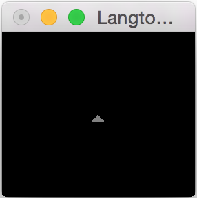

If all that works, then you can get started with [Moving the
Ant](#part-0-moving-around)!

## Where do I get help?

If you are looking for documentation on each of the internals, check out the
[Documentation Content](#documentation-content).

If you are feeling overwhelmed with the work required in this assignment, don't
forget the following resources that are available for you to find help:

- PAL
- Study Events
- Tutor
- Piazza

For **Piazza**, please stick to the following guidelines:
- Ask **specific** questions.  We are happy to help you with the concepts, but
  asking questions like "How do I do the assignment?" are too broad for us to
  reply to in any helpful way.
- Use the **search** function.  There is a high likelihood that someone else
  has already asked the same question as you and it has been answered by us
  already.
- Write **meaningful topic titles**.  They are the first things that anyone
  will look at, and should describe your problem clearly and concisely.
- **Do not paste code** into Piazza.  If you must ask for help on code, use a
  **private** post.

## When is the assignment due?

There are **two due dates**:

- Due Week 7 (1 April, 5pm)
  - Stage 0: getting the ant to move around (10%)
- Due Week 8 (22 April, 5pm)
  - All remaining stages

## How do I submit my code?

Share your repository with your tutor, and we will pull your code when it is
due.

## How will I be marked?

  - COMP1100 students
    + Part 0:     10% (by 1 April, 5pm)
    + Part 1:     35%
    + Part 2:     30%
    + Report:     20%
    + Style:      5%
  - COMP1130 students
    + Part 0:     8%  (by 1 April, 5pm)
    + Part 1:     28%
    + Part 2:     24%
    + Extensions: 20%
    + Report:     16%
    + Style:      4%

## Can I work with my friends?

You are by all means allowed to share **ideas** with your friends.  However,
anything that you hand in (code *and* report) has to be entirely your own work.

Do not assume that we cannot detect copied code, even if you think otherwise.
We have been looking at code for much longer than you have.

See the [Plagiarism](#collaboration-versus-plagiarism) section for a clear
run-down on this.

## Why do you keep calling the ant a 'she'?

From Wikipedia's [Ant][wp-ant] page:

> Larger colonies consist mostly of sterile, wingless females forming castes of
> "workers", "soldiers", or other specialised groups.

## Assignment Contents

- [Part 0: Getting the ant to move around](#part-0-moving-around)
- [Part 1: Moving in the SquareWorld](#part-1-painting-in-squares)
- [Part 2: Moving in the HexWorld](#part-2-painting-in-hexagons)
- [Extensions](#extension-required-for-comp1130)
- [Explanatory report](#explanatory-report)
- [Style With Hlint](#style-with-hlint)

_All **COMP1130** students are expected to attempt an [extension](#extension-required-for-comp1130)._

## Documentation content

- [How to build and install Langton's Ant](INSTALL.md)
* Data Structures
  * [Ant, HexAnt](#ant)
  * [Cells](#cells)
  * [Transition, Turn, Direction](#transitions)
  * [Worlds](#worlds)
* [Acceptable collaboration vs. plagiarism](#collaboration-versus-plagiarism)


# Specification

## Part 0: Moving around

Run `./run_langtons_ant -m part0` in your terminal and you should see this:


Not very exciting...

Your first assignment is to make the Ant run in a circle.


The best way to get started is to read the documentation on
[data structures](#worlds). All of the data structure implementations are in
[src/Datastructures/](./src/Datastructures).

Once you have some idea about what the data structures are like, head over to
the [src/StudentSources/LangtonsAnt.hs](src/StudentSources/LangtonsAnt.hs)
file. That is where you will write your solution to part 0.

You are **assessed** on your implementation of these functions:

```Haskell
turnAnt :: SquareTurn -> SquareWorld -> SquareWorld
turnAnt direction squareWorld = squareWorld

moveAnt :: SquareWorld -> SquareWorld
moveAnt squareWorld = squareWorld

getDirection :: SquareWorld -> Direction
getDirection squareWorld = error "getDirection not implemented"

getCoord :: SquareWorld -> Coord
getCoord squareWorld = error "getCoord not implemented"
```

This function is already written for you, and represents the movement of the ant. For every `squareWorld` that the function is given, it will turn the ant to the left, and move one square forward, using the function defined above. It is called automatically by the framework, and therefore represents the entry point into your code.


```Haskell
walkInACircle :: SquareWorld -> SquareWorld
walkInACircle squareWorld = moveAnt (turnAnt L squareWorld)
```

The below picture is an overlay of all four states achieved by the donut ant, including a representation of the grid that the ant moves throughout.

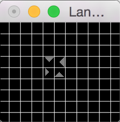

## Part 1: Painting in Squares

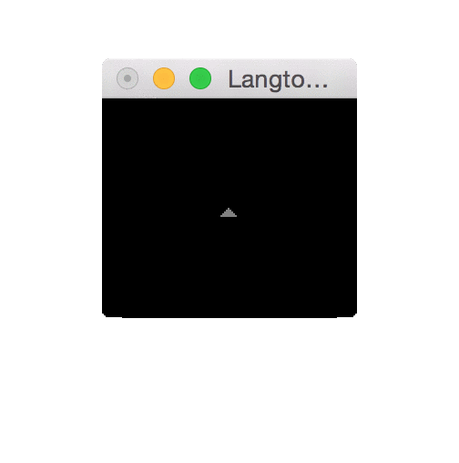

To run this part, execute `./run_langtons_ant -m square`.

Langton's Ant follows a very simple set of rules: if she's at a cell that is
_off_ then she turns it on, turns to the right, and takes a step forward. If
the cell she's at is _on_, she turns it off, turns to the left and takes a
step forward.  These simple rules give rise to some very interesting
behaviour. At the start (if the world contains only cells that are off), she
starts building in what seems to be an almost ordered way, but it quickly
descends into chaos.  After about ten thousand steps she then gets bored and
tunnels away forever.  It's unknown (but believed true) that even if the world
is not entirely clear (i.e., some cells are on), she will still eventually
tunnel off.

Let's take a walk through what this looks like. The initial state we are going to start off with is an empty world with a single ant facing north. This is step 0, since it is the start state.

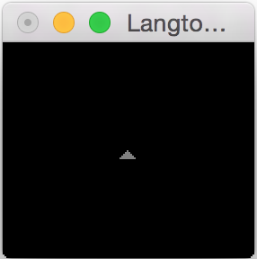

In this state, we are on an _off_ cell. Meaning that our ant turns the cell _on_, takes a _right_ turn, and steps forward. As we follow the progress of the world, we see that this happens another 3 times.

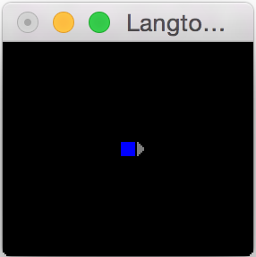 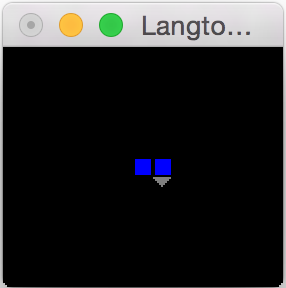 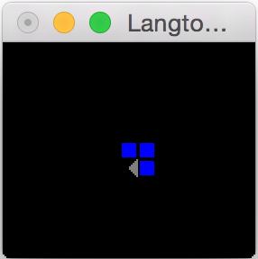
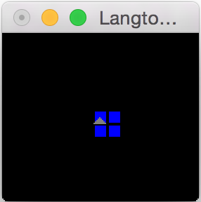

On the last one, we observe that we've reached an _on_ cell. Therefore, this time we turn the cell _off_, take a _left_ turn, and step forward.

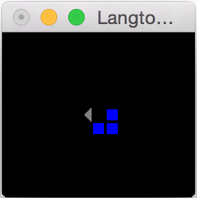

We've reached another _off_ cell, and end up in another series of right turns.

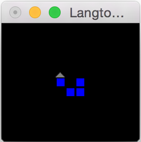  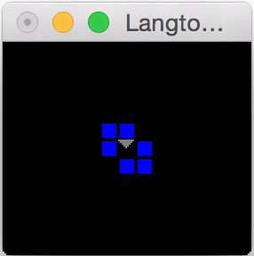
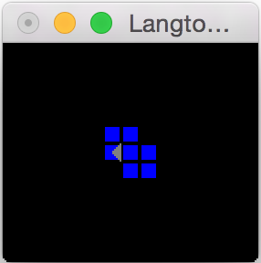

And from here you should be able to guess what happens next. The animation above shows the first 20 steps of Langton's Ant, and the individual step pictures are [here](screenshots/langtonSquare/).

This is the core part of the assignment. Luckily we've already done half the
work we need in the previous part since by now we can already make the ant
move.  The next function you'll need to write is `transitionWorld`, which ties
this all together.  It needs to perform the three steps the ant does:

1. Turn the ant in the correct direction
2. Update the cell the ant is standing on
3. Move the ant forward

```haskell
transitionWorld :: CellState -> SquareWorld -> SquareWorld
transitionWorld firstCell squareWorld = squareWorld
```

The fact that the world is initially empty complicates things a bit -- you
might want to ensure that the cell exists first before trying to transition it,
for example.  That's what `firstCell` is for: it gives the state of cells that
haven't yet been created yet.

Another function you will need to implement is `readSquareTransition` which
takes a string of 'L's and 'R's and turns them into a list of transitions. You
want the function to fail if it reads an invalid character, which is anything
other than an 'L' or an 'R'. For example:

```haskell
λ> readSquareTransition "LLRL"
Just [L,L,R,L]
λ> readSquareTransition "LLRP"
Nothing
```

You will use this function when you want to specify your own behaviour for the
ant instead of Langton's.  To see her in action, use
`./run_langtons_ant -m square -t "LRRL"` (for example).


## Part 2: Painting in Hexagons

To run this part, execute `./run_langtons_ant -m hex`.

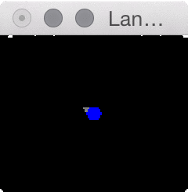

This part of the assignment is nearly identical to part 1, with a small
twist. Our [`Ant`](#ant) now has to walk over a **hexagonal** grid. The
data types have changed very slightly, but not in any major way.

The description of transition systems is slightly more complicated, since a
move might be described by one letter ('U' and 'D') or with a letter and a
number ('L1','L2','R1',R2'). See [here](#transitions) to see what is meant by
that.

As before we need to write a function to move the `Ant` forward, to set a
`Cell` and to turn the `Ant`. Luckily setting a `Cell` is pretty much the same
as before, and turning is only slightly more complicated.  However, the real
challenge is in moving the ant around.

As before, there are <i>x</i> and <i>y</i> coordinates, but since the cells
are now hexagons, the way they relate to the placement is different.  We use
the **axial coordinate system** (also known as trapezoidal coordinates) to
represent the layout of hexagons.

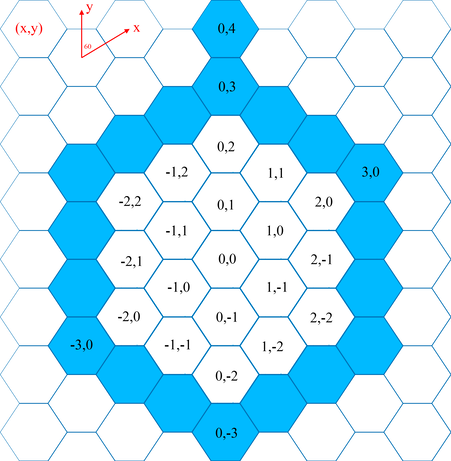

Other ways to represent hexagonal coordinates exist, such as offset or cubic
coordinates.  To learn more about these systems (which you will want to do),
check out [this handy document][rbg-hexagon], which contains interactive
examples.

Play around with just moving the ant forward to make sure she's going in the
right directions.

## Extension: **required** for COMP1130

All COMP1130 students must implement at least one extension.  COMP1100
students can ignore extensions and still receive full marks, though they may
be able to use marks from extensions can be used to redeem lost marks on other
assessments in the course.

This is the part of the assignment where you get free-reign in what you're
doing. What we want you to do is impress us; show us something cool that also
shows your knowledge of concepts in the course, or of computer science in
general.

In the event you can't think of anything, here are a few suggestions. Whilst
you're better of doing one extension well rather than many poorly, feel free
to implement as many as you want. Obviously, an easier extension is worth
fewer marks, so even with an a very implemented *Easy* extension, a COMP1130
may not be able to get full marks.

Once you've finally written one of these you'll need to modify Main.hs so
you can actually call it. Look for the pattern match against
`getArg args Mode` and you should be see where to add your code. You should
just be able to copy and paste a previous example and make a few minor changes
to get it to work. If you get stuck, post to the Piazza forums

- Multiple Ants (Difficulty: *Easy*)
    - Because of the nature of Langton's ant, you don't need any special
      handling of multiple ants on the same cell — every ant on the same cell
      wants the cell to become the same colour as every other ant on it.
    - You can have the same transition for each Ant, or a different transition
      system for each one.
    - Mix Hex Ants and Square Ants on the same Grid (the file provided doesn't
      support this, but it shouldn't be too hard to add)
    - `Datastructures/MultiAntWorld.hs` already exists!
- Turmites (Difficulty: *Moderate* / *Hard* )
    - Turmites are ants which have their own internal state, which they can use
      to make decisions.
    - They're exceptionally powerful — any algorithm you can run (e.g.,
      Fibonacci, factorial, mergesort) can also be run by a Turmite (with at
      least 2 colours of cell and an arbitrary number of states) given the
      correct transition function
    - Once you've gotten Turmites to run, trying “programming” something with
      turmites, like multiplying two unary numbers (or binary numbers if you're
      feeling adventurous).
    - There's already a type defined (see `Datastructures/Turmite.hs`) for you
      but no world type, so you'll need to define that yourself.
- World generation (Difficulty: *Hard*)
    - Currently, the world always starts blank. You've probably realised that
      you can hard code a world in, but wouldn't it be nice if we could do
      something like draw an ASCII art image of the world, and give it to our
      program to start with using command-line arguments instead of starting
      blank.
- Dense world (Difficulty: *Hard*)
    - To represent the world, we currently have a list of Cells that the Ant
      has visited. Since our world is infinite it seems quite silly to
      represent every cell explicitly present in the world. Nonetheless,
      laziness of data structures in Haskell allows us to program things as if
      we do.  Be prepared for reasoning about laziness.
    - `Datastructues/DenseWorld.hs` already exists with the "hard" work done
      for you.
    - Don't expect too much performance if you're drawing lots of frames —
      while the dense world only draws a rectangle from the minimum coordinate
      the Ant has visited, to the maximum coordinate she's visited, that
      quickly becomes a large area.
    - Try comparing times for transition systems that tunnel off rapidly
      against ones where the Ant stays in a relatively small area.
- Superior datastructures (Difficulty: *Varying*)
    - The way the world is represented currently (a list of Cells) is probably
      not the optimal way to represent it — the time it takes to find a cell in
      the world will grow linearly with the number of active cells.
    - Look at instead using a data structure like a binary search tree (and
      get a head start for later on in this course).
    - To make it drawable, you'll need to define `WorldLike YourWorldType
      YourAntType` look at how this is done for `SimpleWorld`. You need to
      define three functions, `worldShape` which ignores its argument and
      returns either `Hex` or `Square` depending on the shape. `worldContents`
      which returns a list of cells so we can draw the world and `worldAnts`
      which returns every ant in the world.  You'll probably only return one
      ant, so just put it in square brackets to make it a list with only one
      element.
- A different cellular automaton (Difficulty: *Hard*)
    - Whilst the code isn't exactly set up for it, you could program a
      completely different cellular automaton (for example Wireworld or
      Conway's game of Life).  As above you'll have to define your own
      `WorldLike` definition, which probably will have no ants (but you'll
      still need to give `WorldLike` an ant type, even if you don't use it.
      Make the `worldShape` a `Square` and `worldAnts` the empty list and it
      shouldn't be too hard to do (And you'll probably need a bogus list of
      transitions to trick it into having the correct number of colours)
- Probabilistic Langton's Ant (Difficulty: *Easy*)
    - Instead of having an ant already turn left or right, make it turn based
      on a probability (i.e., on Cell 0, turn left with 90% chance and right
      with 10% chance, and on Cell 1 turn left with 10% chance and right with
      90% chance)
    - Since Haskell functions are “pure” you can't just generate a random
      number in the function.  The best way is probably to pass in an
      *infinite* list of random numbers from main and have the list as a part
      of your world type. If you're really interested in this ask on Piazza
      and one of the tutors will guide you through how to do things.

## Explanatory Report

(Based on content written by Uwe Zimmer)

Write a short report that addresses the following items:

- What is the rationale for your program design? Did you consider
  alternatives? Which alternatives? Why did you choose the designs you
  now submit?  What makes your solutions efficient and/or elegant? Or are
  your solutions less efficient but more readable?
- Attach time measurement data and explain why this confirms or contradicts
  your expectations. Would you consider changing anything in your programs to
  change those measurements?  Specifically, what would you change?
  + By the way, the "After 5000 transitions the ant is at Coord {xCoord = 2, yCoord = -10} and it took us 0.056613s to calculate that" is run without drawing each state. It is there to help you benchmark your code.
65s to calculate that
- What did you observe while programming a new datatype or automaton in the
  extension section of this assignment? Was this comparable to other
  programming you did so far? How was it similar or different?
- Did you learn anything (technical/scientific abilities or knowledge as well
  as other skills) during this assignment? What did you learn? What was the
  most interesting part of the assignment, and what did you spend the most
  time with?

You can structure your report in whatever form you choose (and use any program
you like) as long as you address the requested items and the output is of
reasonably professional quality. Technically all fonts and graphics need to be
“vector form”, so no pixelated or “bitmap” graphics (except when you attach
screenshots, scans or photos — scans or photos will need to be of reasonable
high resolution). For readability, switch on kerning and ligatures in your
word processor or layout program. All popular, current day programs can
produce professional looking outputs (with varying degrees of effort) — one
exception is “Kingsoft Office” or “WPS Office”, which is known to produce
output to make us cry.  Your plots can for instance be done on a piece of
paper and scanned or photographed (as long as they are clear and
complete). Your final output document always needs to be in `pdf` format.

Your writing should always be concise, so avoid or remove “fluff” in your text
— no marks are awarded for text length, but marks are removed for texts of a
rambling nature. If you need support in technical writing in general or to
manage your time at uni then check out the offers at:
https://academicskills.anu.edu.au/

If you are not sure what is expected of you: just ask us for clarification and
further details.

## Style With Hlint

Please write stylistically clean and lucid programs.  For guidance, consider
the rules described
[here](http://www.seas.upenn.edu/~cis552/styleguide.html). Some of these style
guidelines can be checked automatically by the
[hlint](http://community.haskell.org/~ndm/hlint/) tool; so be sure to run it
on your assignment before you submit.

# Collaboration versus Plagiarism

Please recall the
[Course Statement on Plagiarism](https://gitlab.cecs.anu.edu.au/comp1100-2016/homepage/wikis/home#academic-integrity).

This course does allow for collaboration if properly indicated in the
submission and some additional rules are followed:

- The writing of code and documentation that you intend to submit must always
  be done entirely by you.
- You may exchange ideas on scrap paper, boards, and the like, but you may not
  work together on shared documents that are intended for submission. You may
  not use any of the scrap documents for your final submission — make sure that
  they stay in the meeting place, and do not find their way into your pocket.
- You may not collaborate or communicate with other students about your
  submission right before you start writing your submission documents. After
  you discuss ideas with anybody else, you need to wait at least six hours
  before you start writing your own submission. This implies that you need to
  plan your work and discuss your concepts (if you choose to do so) well ahead
  of any deadline.

Detection is very likely (even though it might not always appear so from an
individual perspective), and the consequences of plagiarism are harsh. Please
help to make this a clean course which focuses entirely on the learning
process and not on policing.

# Documentation

## Ant
[Source][src-Datastructures-Ant-Ant]

An `Ant` is the ant for square grids. It contains its own position,
the direction it is currently facing, and the rules it follow to transition.

```haskell
data Ant = Ant {antPosition :: Coord, antOrientation :: Direction, antTransition :: [Transition SquareTurn]}
```
Langton's original ant at (0,0) facing North would be `Ant (Coord 0 0) N [Transition 0 R, Transition 1 L]`.

The reason the `Ant` contains its transition system instead of the world, is
to make it easier for students doing an extension like multiple ants; that way
they can have multiple ants in the same world with different transition systems.

### HexAnt
[Source][src-Datastructures-Ant-HexAnt]

A `HexAnt` is nearly identical to an [`Ant`](#ant). The only difference is
that the direction is a `HexDirection` and `hexantTransition` has type
`[Transition HexTurn]`

```haskell
data HexAnt = HexAnt { hexantPosition :: Coord
                     , hexantOrientation :: HexDirection
                     , hexantTransition :: [Transition HexTurn]}
```

## Cells

### Coord
[Source][src-Datastructures-Cells-Coord]

This type is defined just the way you'd expect: a pair comprising an
<i>x</i>-coordinate and a <i>y</i>-coordinate.

```haskell
data Coord = Coord {xCoord :: XCoord, yCoord :: YCoord}
type XCoord = Integer
type YCoord = Integer
```

### Colour
[Source][src-Datastructures-Cells-Colour]

A colour is really just a number. It refers to what state the cell is
currently in.  The reason it is not a special data type is because later on in
the assignment we're going to read in arbitrary transition systems, so we won't
know how many colours there are going to be.

```haskell
type Colour = Integer
```

### CellState
[Source][src-Datastructures-Cells-CellState]

This type refers to the current state of a cell in the world. You don't need
to worry about its definition. Instead you'll want the following two functions

```haskell
nextCellState :: CellState -> CellState
```

This function takes a `CellState` and puts it in the next state. For example,
on a world with only two colours, it'll take a `0` to a `1`, and a `1` to a
`0`

```haskell
getStateColour :: CellState -> Colour
```

This function takes a `CellState` and gives you its current
`Colour`. Hopefully, this is pretty self-explantory. You don't need to worry
about how these are defined, but if you're curious a `CellState` is an
infinite list of `Colour` in the correct order and `nextCellState` is just
`tail`, and `getStateColour` is just `head`.

### Cell
[Source][src-Datastructures-Cells-Cell]

A cell is a pair of coordinates and the state that it's currently in.

```haskell
data Cell = Cell {cellPosition :: Coord, cellState :: CellState}
```

## Worlds

### SquareWorld
[Source][src-Datastructures-SquareWorld-SquareWorld]

A `SquareWorld` contains the [Ant](#ant) in the world, a list of [Cell](#cell)
which are all the *active* cells in the world. By *active* we mean a `Cell`
the `Ant` has walked on at least once. The reason we only store the cells an
ant has walked over is that the world is infinite; it would be quite hard to
look through an infinite list quickly.

```haskell
data SquareWorld = SquareWorld { theAnt :: Ant, theWorld :: [Cell]}
```

### findCell
[Source][src-Datastructures-SquareWorld-findCell]
This is a function you may find useful.

```haskell
findCell :: Coord -> SquareWorld -> Maybe Cell
```

### HexWorld
[Source][src-Datastructures-HexWorld-HexWorld]

See the documentation for [`SquareWorld`](#squareworld) it's pretty much the
same, but with a `HexAnt`.

```haskell
data HexWorld = HexWorld { theAnt :: HexAnt, theWorld :: [Cell]}
```


## Transitions

### Direction
[Source][src-Datastructures-Transitions-Direction]

For an ant on a square grid, there are four directions it could be
facing: North, East, South, or West.

```haskell
data Direction = N | E | S | W
```

### SquareTurn
[Source][src-Datastructures-Transitions-SquareTurn]

For an ant on a square grid, there are two directions it can turn: left
or right. If you want, you can add no-turn and U-turn.

```haskell
data SquareTurn = L | R
```

### Transition
[Source][src-Datastructures-Transitions-Transition]

A transition is a pair that describes what to do: given a cell `Colour` just
what action to take.

```haskell
data Transition a = Transition {onColour :: Colour, turnDirection :: a}
```

It is parametrised by the type of turn, since this differs for a square grid
and a hex grid. If the type is `Transition SquareTurn` then `turnDirection`
could either be `L` or `R`.

### HexDirection
[Source][src-Datastructures-Transitions-HexDirection]

For Hex grids, the world is made up of hexagons, with flat sides at the top
and bottom, and corners at the left and right. The ant only moves over flat
sides, so the six directions are Up, Down, Right-and-Up, Right-and-Down,
Left-and-Up, and Left-and-Down.

```haskell
data HexDirection = Up | Dn | RU | RD | LU | LD
```

### HexTurn
[Source][src-Datastructures-Transitions-HexTurn]

There are 6 directions to turn on the hex grid. We can choose not to turn.  We
can also choose to turn either 60&deg; or 120&deg; to either the left or
right.  Finally we can perform a U-Turn (i.e., turn 180&deg;). We could have
chosen to disallow No-Turn and U-Turn like in `SquareTurn`, but most
interesting transition systems on a hex grid make use of them. In Haskell we
write them like this (note, we couldn't use `N` for `None`, because `N` is
already used (meaning North) in `Direction`.

```haskell
data HexTurn = L2 | L1 | None | R1 | R2 | U
```

[wp-ant]: https://en.wikipedia.org/wiki/Ant
[wp-langtons]: https://en.wikipedia.org/wiki/Langton's_ant
[anu-plagiarism]: http://www.anu.edu.au/students/program-administration/assessments-exams/academic-honesty-plagiarism
[rbg-hexagon]: http://www.redblobgames.com/grids/hexagons/#coordinates

[src-Datastructures-Ant-Ant]: src/Datastructures/Ant.hs#L16-29
[src-Datastructures-Ant-HexAnt]: src/Datastructures/Ant.hs#L31-34
[src-Datastructures-Cells-Cell]: src/Datastructures/Cells.hs#L19-20
[src-Datastructures-Cells-Colour]: src/Datastructures/Cells.hs#L22
[src-Datastructures-Cells-Coord]: src/Datastructures/Cells.hs#L16-17
[src-Datastructures-Cells-CellState]: src/Datastructures/Cells.hs#L34-47
[src-Datastructures-Cells-getStateColour]: src/Datastructures/Cells.hs#L29-32
[src-Datastructures-Cells-nextCellState]: src/Datastructures/Cells.hs#L24-27
[src-Datastructures-HexWorld-HexWorld]: src/Datastructures/HexWorld.hs#L16-17
[src-Datastructures-HexWorld-newHexWorld]: src/Datastructures/HexWorld.hs#L19-20
[src-Datastructures-SquareWorld-SquareWorld]: src/Datastructures/SquareWorld.hs#L16-19
[src-Datastructures-SquareWorld-findCell]: src/Datastructures/SquareWorld.hs#L27-34
[src-Datastructures-SquareWorld-newSquareWorld]: src/Datastructures/SquareWorld.hs#L21-24
[src-Datastructures-Transitions-Direction]: src/Datastructures/Transitions.hs#L15-16
[src-Datastructures-Transitions-HexDirection]: src/Datastructures/Transitions.hs#L40-42
[src-Datastructures-Transitions-HexTurn]: src/Datastructures/Transitions.hs#L36-38
[src-Datastructures-Transitions-SquareTurn]: src/Datastructures/Transitions.hs#L30-34
[src-Datastructures-Transitions-Transition]: src/Datastructures/Transitions.hs#L11-13
